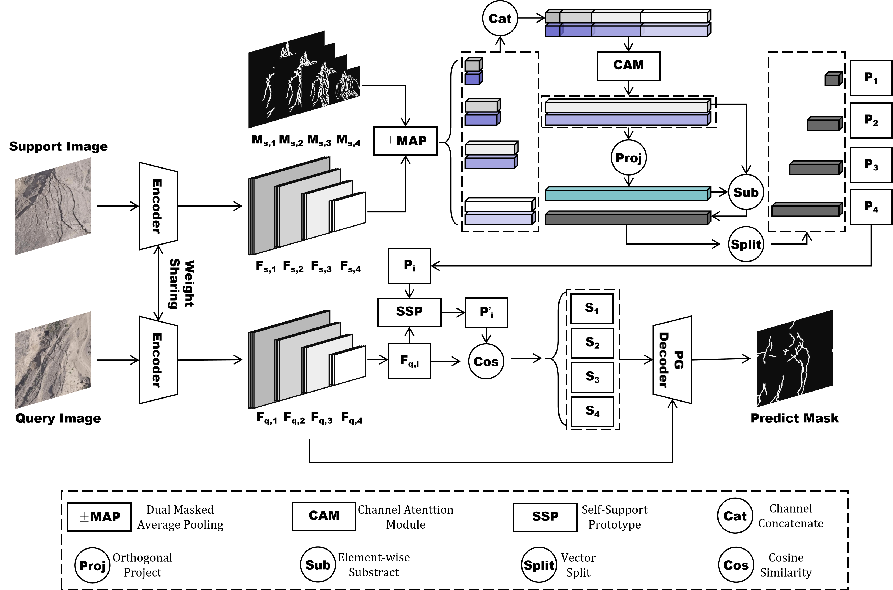

# MPDFormer: Multi-scale Prototype Learning with Orthogonal Denoising for Few-Shot Crack Segmentation

**MPDFormer** is a few-shot crack segmentation framework for UAV imagery. It follows an
episode-based prototype-learning paradigm: a weight-shared Mix Vision Transformer (MiT)
encodes multi-scale support/query features, foreground–background prototypes are built with
masked average pooling (MAP), an **Orthogonal Separation and Denoising Fusion Module (OSDFM)**
suppresses foreground–background semantic contamination caused by annotation noise, a
**Self-Supporting Prototype (SSP)** module calibrates prototypes toward the query distribution,
and a **Prototype-Guided Decoder (PGDecoder)** injects multi-scale prototype similarity maps
into query features through gated modulation for fine-grained crack segmentation.

<p align="center">
  
</p>


#### Repository Structure

```
MPDFormer/
├── configs/
│   └── default.yaml                     # paper configuration (MiT-b4, CrackSeg9K)
├── train.py                             # Lightning training entry point
├── inference.py                         # few-shot inference on query images
├── dataset.py                           # MPDFormerDataModule (episode-based sampling)
├── lightning_module.py                  # LitMPDFormer: optimizers, warmup+cosine LR, EMA, metrics
├── models/
│   ├── mit_encoder.py                   # MiT (MixVisionTransformer) encoder wrapper
│   ├── prototype_pooling.py             # masked average pooling & cosine similarity maps
│   ├── orthogonal_prototype_fusion.py   # OSDFM
│   ├── ssp_refinement.py                # SSP module
│   ├── acf_decoder.py                   # PGDecoder (ACFPrototypeDecoder)
│   └── prototype_acf_segformer.py       # full MPDFormer model
├── losses/                              # BCE + soft Dice + Focal (learnable weights), boundary loss
├── datasets/                            # episode dataset and image/mask loading
├── utils/                               # metrics (F1/mIoU/Acc), transforms, visualizer, ...
├── SegFormer/                           # vanilla SegFormer baseline (b0–b5) + weight downloader
└── fig/method_overview.png              # overall architecture
```

## Getting Started

### 1. Environment

- Python ≥ 3.8 (tested on 3.8 and 3.11)
- PyTorch ≥ 2.0 (tested with 2.1.0 + CUDA)

```bash
# install PyTorch matching your CUDA build first, e.g.:
pip install torch==2.1.0 torchvision==0.16.0 --index-url https://download.pytorch.org/whl/cu121
pip install -r requirements.txt
```

### 2. Datasets

**Training / validation:** [CrackSeg9K](https://github.com/zhao-ju/CrackSeg9K) — arrange the
data as:

```
data_root/
├── train/
│   ├── images/          # xxx.jpg
│   └── masks/           # xxx.png (binary, matching stems)
└── val/
    ├── images/
    └── masks/
```

### 3. Backbone weights

ImageNet-pretrained MiT weights (b0/b1/b2/b3/b4/b5) are downloaded automatically on first run
to `checkpoints/mit_<variant>.pth`, from the URLs listed in `SegFormer/model.py` (currently a
HuggingFace mirror — replace them with the official `nvidia/mit-*` URLs if you prefer).

You can also download them manually:

```bash
python SegFormer/download_pretrained.py --variant b4   # saved to SegFormer/checkpoints/
```

or pass an existing file with `--backbone-weights-path /path/to/mit_b4.pth`.

## Training

The paper configuration is `configs/default.yaml`: MiT-b4, 512×512, 1-shot, 200 epochs,
batch size 8, AdamW (lr 1e-4, encoder lr ×0.5), 5-epoch linear warmup + cosine annealing,
5000 episodes/epoch, strong augmentation, AMP, early stopping (patience 25).

```bash
python train.py \
    --config configs/default.yaml \
    --data-root /path/to/CrackSeg9K \
    --save-dir runs/mpdformer_mit_b4_1shot \
    --k-shot 1
```

For the 5-shot setting, add `--k-shot 5`. Any config entry can be overridden from the command
line (e.g. `--backbone b3 --epochs 100 --lr 1e-4 --batch-size 8 --img-size 512`); run
`python train.py --help` for the full list. The resolved configuration is stored as
`resolved_config.yaml` in the save directory.

Each run produces:

- `checkpoints/` — best-3 checkpoints by `val_dice`, plus best `val_miou`, best `val_recall`
  and `last.ckpt` (Lightning format, reloadable with `--resume` / `--load`);
- Lightning CSV/TensorBoard logs (`metrics.csv`, `lightning_logs/`).

Validation metrics (F1, mIoU, Acc, Dice, Recall, Precision) are computed at a 0.5 threshold by
`utils/metrics.py`.

## Inference

Segment query images with k annotated support pairs:

```bash
# a folder of query images + a support folder containing images/ and masks/ sub-folders
python inference.py \
    --checkpoint runs/mpdformer_mit_b4_1shot/checkpoints/checkpoint_epoch200_dice0.8356.ckpt \
    --support_root /path/to/support \
    --query_root /path/to/queries \
    --output_dir results/uav_crack_demo \
    --k_shot 5

# or a single support/query pair
python inference.py \
    --checkpoint runs/mpdformer_mit_b4_1shot/checkpoints/<checkpoint>.ckpt \
    --support_image support.jpg \
    --support_mask support.png \
    --query_image query.jpg \
    --output_dir results/single
```

For every query image, `output_dir` receives:

- `mask/` — binary crack mask (threshold configurable via `--threshold`, default 0.5);
- `prob/` — foreground probability map;
- `overlay/` — original image with the prediction in red;
- `similarity/` — per-stage prototype–query cosine similarity maps.

Model hyperparameters are restored from the Lightning checkpoint automatically; CLI options
(`--backbone`, `--img_size`, `--k_shot`, ...) override them when needed.
